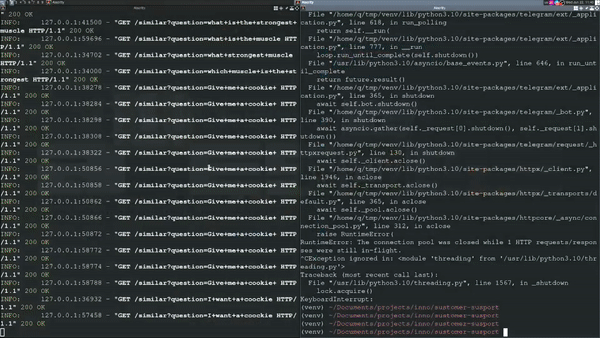

# Seamless Customer Support

[//]: <> (TODO:Badges)
[](https://sonarcloud.io/dashboard?id=InnoSWP_sustomer-susport)

## Description and features list
An open-source web-application easily embeddable into customer's service for seamless usability both for clients (people who ask the questions) and volunteers (people who answer questions)

For that purpose we provide 
- embeddable (via iframe) website
- API for bots
- semantic text parsing (to recognize already asked questions and show answers for them)


## Technologies stack
- [Python 3.10](https://www.python.org)
- [Typescript 4.7](https://www.typescriptlang.org)
- [Flask 2.1.2](https://flask.palletsprojects.com/en/2.1.x/)
- [FastAPI 0.78](https://fastapi.tiangolo.com)
- [BERT](https://github.com/google-research/bert)
- [Google Firebase](https://firebase.google.com)


## Project installation

## How to run
you need 
- `python` ~= 3.10
- `pip` corresponding to your python version

### Add telegram token
- move to bot directory

```cd ./telegram_server```
- copy `.env.tpl`

```cp .env.tpl .env```
- add your token to `.env` file (Use any text editor)

```vim .env```
- go back to project root

```cd ..```

### Add firebase token
Create an environment variable ```firebase_key``` and
set its value to:
- token data in ```json``` format

### Install python requirements
- you may wish to use python virtual env
- install dependencies via `pip`

```pip install -r requirements.txt```


## How to use

### Run server
```python ./master_router.py```

### For developers
- we provide `run.sh` script and `ts.config` to automate process of recompiling 
- if you write on js, be aware, script deletes content of `./flask_server/static/js`


## Demo
[](https://drive.google.com/file/d/1Nwq44h9FfPelErGhZsXWs6-GKN8Y9zgT/view?usp=sharing)

